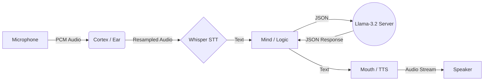

# Sentiric Cortex

[](https://github.com/Sentiric-Core/cortex/actions/workflows/release.yml)
[](LICENSE)
[](https://github.com/Sentiric-Core/cortex/releases)
[](https://www.rust-lang.org/)

**Sentiric Cortex**, yerel donanım üzerinde çalışan, bulut bağımsız, düşük gecikmeli bir Bilişsel Sinyal İşleme (Computational Signal Processing) motorudur. DOOM oyun motorunun felsefesiyle (Bare-metal, Zero-bloat) tasarlanmıştır.

## 🧠 Mimari (The Sidecar Pattern)

Sistem iki ana lobdan oluşur:

1.  **Cortex (Rust):** Beden. Donanım kontrolü, ses I/O, VAD (Voice Activity Detection).
2.  **Brain (C++):** Zeka. `llama.cpp` tabanlı LLM sunucusu.



## 🚀 Hızlı Başlangıç (Linux)

Tek komutla kurulum ve çalıştırma:

```bash
# 1. Repoyu klonlayın
git clone https://github.com/Sentiric-Core/cortex.git
cd cortex

# 2. Kurulum (Bağımlılıklar + Modeller + Derleme)
chmod +x scripts/setup.sh
./scripts/setup.sh

# 3. Başlatma
chmod +x scripts/launch.sh
./scripts/launch.sh
```

## 🛠️ Teknoloji Yığını

- **Dil:** Rust (Edition 2021) & C++
- **STT:** Whisper.cpp (Gömülü)
- **LLM:** Llama-3.2-1B-Instruct (Quantized Q4_K_M)
- **TTS:** Piper (Neural Text-to-Speech)
- **İletişim:** HTTP/JSON (Localhost)

## ⚖️ Lisans

Bu proje **AGPLv3** ile lisanslanmıştır.
